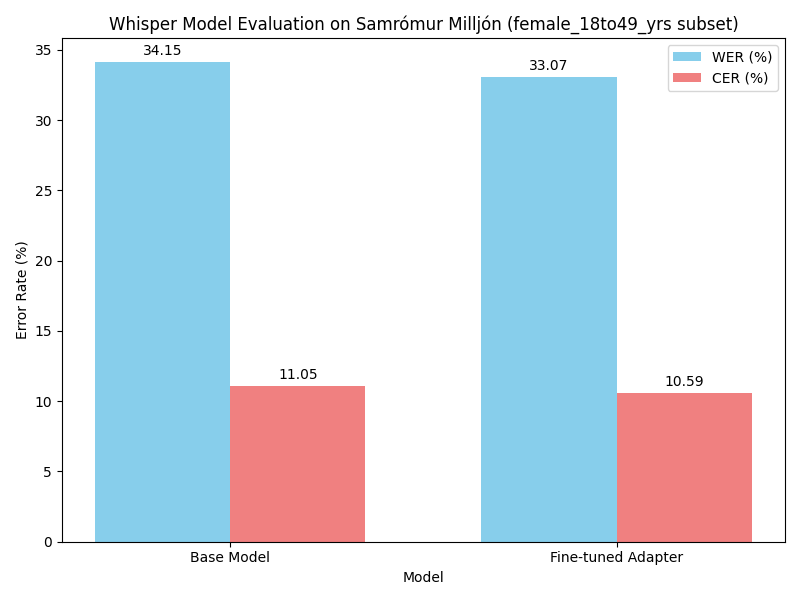

# Fine-tuning Whisper Large v3 for Icelandic Automatic Speech Recognition (ASR)

This project focuses on improving the performance of OpenAI's Whisper Large v3 model for Icelandic speech recognition by fine-tuning it on the Raddrómur Icelandic Speech corpus using Parameter-Efficient Fine-Tuning (PEFT) with LoRA. The fine-tuned model is then evaluated against the base model on a subset of the Samrómur Milljón dataset.

**Date:** May 6, 2025
**Environment:** DGX A100 GPUs

## Objective

To enhance the accuracy of `openai/whisper-large-v3` for transcribing Icelandic speech by leveraging the Raddrómur dataset and LoRA fine-tuning.

## Model

* **Base Model:** `openai/whisper-large-v3`

## Datasets

### Fine-tuning Dataset

* **Name:** Raddrómur Icelandic Speech 22.09 [cite: 1]
* **Source:** Language and Voice Laboratory (LVL) at Reykjavík University (RU) [cite: 1]
* **Description:** ~49 hours of Icelandic speech from radio podcasts (mostly RÚV) with automatically aligned transcriptions[cite: 1]. Audio is 16kHz mono FLAC.
* **License:** [Creative Commons Attribution 4.0 International (CC BY 4.0)](https://creativecommons.org/licenses/by/4.0/) [cite: 1]

### Evaluation Dataset

* **Name:** Samrómur Milljón [cite: 2]
* **Source:** Language and Voice Laboratory (LVL) at Reykjavík University (RU) [cite: 2]
* **Hugging Face ID:** `language-and-voice-lab/samromur_milljon` [cite: 2]
* **Description:** A large corpus (~967 hours) of Icelandic speech automatically verified using multiple ASR systems[cite: 2]. For this project, a subset (e.g., 1000 samples) from a specific demographic split (e.g., `female_18to49_yrs`) was used for evaluation. Audio is 16kHz mono FLAC[cite: 2].
* **License:** [Creative Commons Attribution 4.0 International (CC BY 4.0)](https://creativecommons.org/licenses/by/4.0/) [cite: 2]

## Methodology

* **Fine-tuning Technique:** Low-Rank Adaptation (LoRA) via the `peft` library.
* **Precision:** BFloat16 (`bf16=True`)
* **Attention Implementation:** Scaled Dot Product Attention (`attn_implementation="sdpa"`)
* **Key Libraries:**
    * `transformers`
    * `datasets`
    * `torch`
    * `peft`
    * `accelerate`
    * `evaluate` (using `jiwer`)
    * `bitsandbytes` (for 8-bit optimizer)
    * `wandb` (for logging)
    * `matplotlib` (for plotting results)
    * `uv` (for environment management)
* **Evaluation Metrics:** Word Error Rate (WER), Character Error Rate (CER) - Lower is better.

## Setup & Installation

1.  **Clone Repository (Replace with your repo URL):**
    ```bash
    git clone https://your-repo-url/ice-whisper.git
    cd ice-whisper
    ```

2.  **Create Environment & Install Dependencies using `uv`:**
    * Create a `requirements.txt` file with the following content:
        ```
        transformers>=4.38.0 # Example version, adjust as needed
        datasets>=2.16.0
        torch>=2.1.0
        peft>=0.9.0
        accelerate>=0.27.0
        evaluate>=0.4.0
        jiwer>=3.0.0
        matplotlib>=3.7.0
        pandas>=2.0.0
        librosa>=0.10.0
        soundfile>=0.12.0
        wandb>=0.16.0
        bitsandbytes>=0.42.0
        ipywidgets>=7.6.0 # For Jupyter progress bars
        # numpy is usually a dependency of others, but good to list
        numpy>=1.23.0
        # uv is used for installation, not needed in requirements.txt itself
        ```
    * Create and activate the environment, then install:
        ```bash
        # Create environment
        uv venv .venv
        # Activate environment
        source .venv/bin/activate
        # Install requirements
        uv pip install -r requirements.txt
        # Optional: Install flash-attn for potential speedup (requires compilation)
        # uv pip install flash-attn --no-build-isolation
        ```
    * *(Optional) Migrate to `pyproject.toml`:*
        ```bash
        uv init --bare # If pyproject.toml doesn't exist
        uv add -r requirements.txt
        ```

3.  **Login to Weights & Biases:**
    ```bash
    wandb login
    ```
    Follow the prompts or set the `WANDB_API_KEY` environment variable.

## Usage

### 1. Fine-tuning (`finetune_whisper_ice_lora.py`)

This script fine-tunes the base Whisper model using LoRA on the Raddrómur dataset.

* **Configuration:** Modify paths for the Raddrómur dataset (`DATA_DIR`) and the desired output directory (`output_dir` in `Seq2SeqTrainingArguments`) inside the script. Adjust training parameters as needed.
* **Running:** Use `torchrun` for multi-GPU training. Set `CUDA_VISIBLE_DEVICES` to specify GPUs. Use `nohup` or `screen`/`tmux` for background runs.

    **Example Command (using GPUs 6, 7):**
    ```bash
    # Activate environment
    source .venv/bin/activate
    # Run via screen (recommended)
    screen -S whisper_finetune
    # Inside screen:
    env CUDA_VISIBLE_DEVICES=6,7 torchrun --nproc_per_node=2 finetune_whisper_ice_lora.py > finetune_output.log 2>&1
    # Detach: Ctrl+A then D
    ```
* **Monitoring:** Check `finetune_output.log` and the Weights & Biases dashboard.
* **Output:** LoRA adapter checkpoints saved in the specified output directory (e.g., `./whisper-large-v3-is-raddromur-lora-wandb/checkpoint-XXX`).

### 2. Evaluation (`evaluate_whisper.py`)

This script evaluates the base model and a fine-tuned adapter checkpoint on a subset of the Samrómur Milljón dataset, calculating WER and CER, and generating a comparison plot.

* **Configuration:** Modify `ADAPTER_CHECKPOINT_PATH`, `EVAL_DATASET_ID`, `EVAL_SPLIT`, and `EVAL_SUBSET_SIZE` inside the script.
* **Running:** Runs on a single GPU by default.

    **Example Command:**
    ```bash
    # Activate environment
    source .venv/bin/activate
    # Run evaluation
    python evaluate_whisper.py
    ```
* **Output:**
    * WER/CER results printed.
    * Comparison bar chart saved as `whisper_samromur_evaluation_comparison.png`.

## Results

The models were evaluated on a `1000`-sample subset of the `female_18to49_yrs` split from the `language-and-voice-lab/samromur_milljon` dataset.

**Evaluation Metrics (Lower is Better):**

| Model                | WER (%) | CER (%) | Stereo Files Found | Eval Error |
| :------------------- | :-----: | :-----: | :----------------: | :--------: |
| Base Model           |  34.15  |  11.05  |         0          |   False    |
| Fine-tuned Adapter   |  33.07  |  10.59  |         0          |   False    |

*(Note: `eval_error` was NaN for the adapter run, interpreted as False since evaluation completed.)*

**Comparison Plot:**



**Interpretation:** The fine-tuned LoRA adapter shows a modest improvement over the base `whisper-large-v3` model on this specific subset of the Samrómur Milljón evaluation data, reducing both Word Error Rate (by ~1.08 points absolute) and Character Error Rate (by ~0.46 points absolute). Further evaluation on larger or different test sets might reveal more significant differences. No stereo files were detected in the evaluation subset.

## License

The code in this repository is licensed under the [Your Chosen License - e.g., MIT License].

The datasets used have their own licenses:
* Raddrómur Icelandic Speech 22.09: CC BY 4.0 [cite: 1]
* Samrómur Milljón: CC BY 4.0 [cite: 2]

## Acknowledgements

* The Language and Voice Laboratory (LVL) at Reykjavík University for creating the Raddrómur and Samrómur Milljón datasets[cite: 1, 2].
* The Language Technology Programme for Icelandic 2019-2023, managed by Almannarómur and funded by the Icelandic Ministry of Education, Science and Culture, for funding the dataset creation[cite: 2, 54].
* OpenAI for the Whisper model.
* Hugging Face for the `transformers`, `datasets`, `evaluate`, `peft`, and `accelerate` libraries.
* The Weights & Biases platform for experiment tracking.
* Astral for the `uv` tool.

## Citations

1.  Mena, Carlos et al. "Raddrómur Icelandic Speech 22.09". Web Download. Reykjavik University: Language and Voice Lab, 2022. [cite: 1]
2.  ```bibtex
    @inproceedings{mena2024samromur,
        title={Samr{\'o}mur Millj{\'o}n: An ASR Corpus of One Million Verified Read Prompts in Icelandic},
        author={Mena, Carlos Daniel Hernandez and Gunnarsson, {\TH}orsteinn Da{\dh}i and Gu{\dh}nason, J{\'o}n},
        booktitle={Proceedings of the 2024 Joint International Conference on Computational Linguistics, Language Resources and Evaluation (LREC-COLING 2024)},
        pages={14305--14312},
        year={2024}
    }
    ```
    [cite: 2]